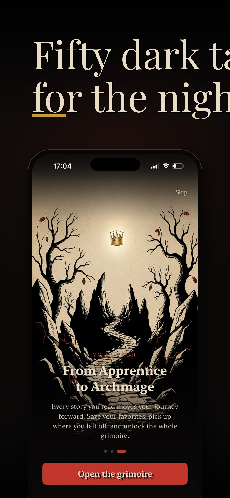
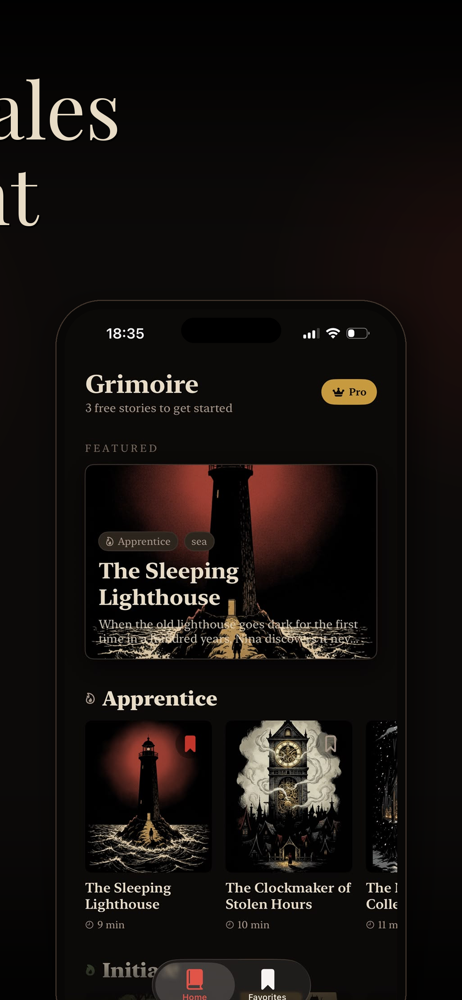
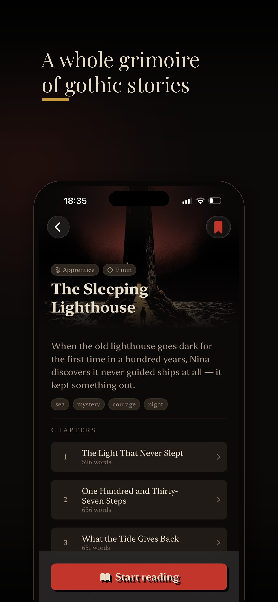
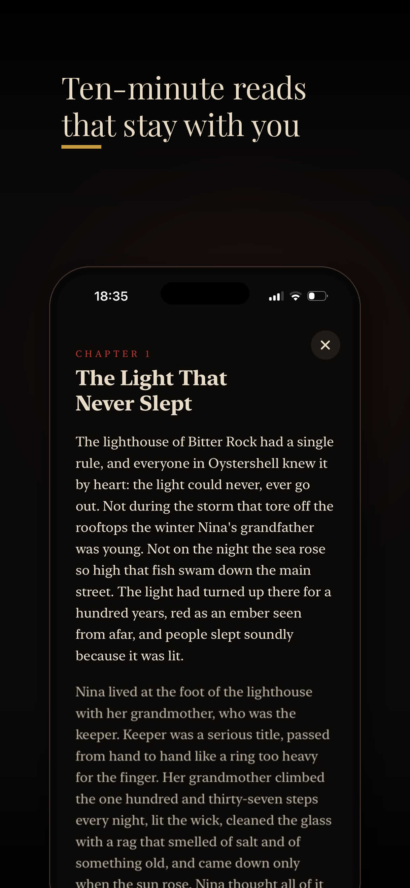
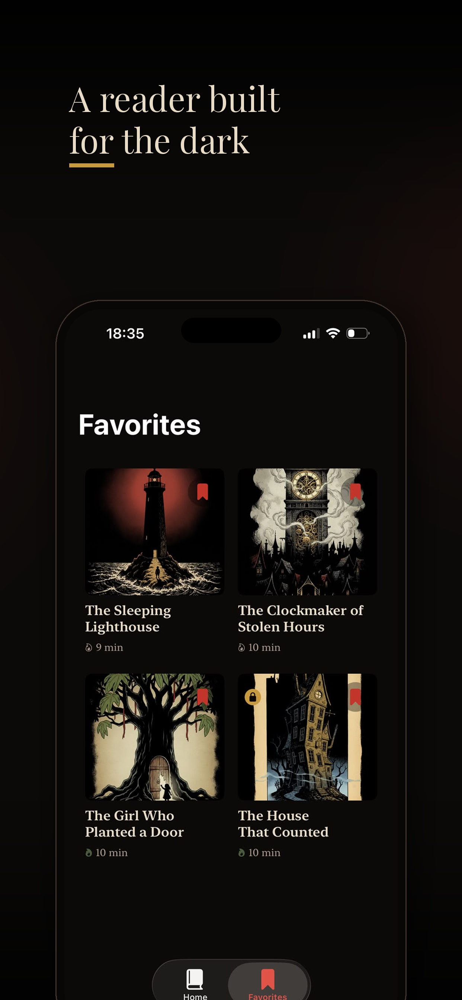
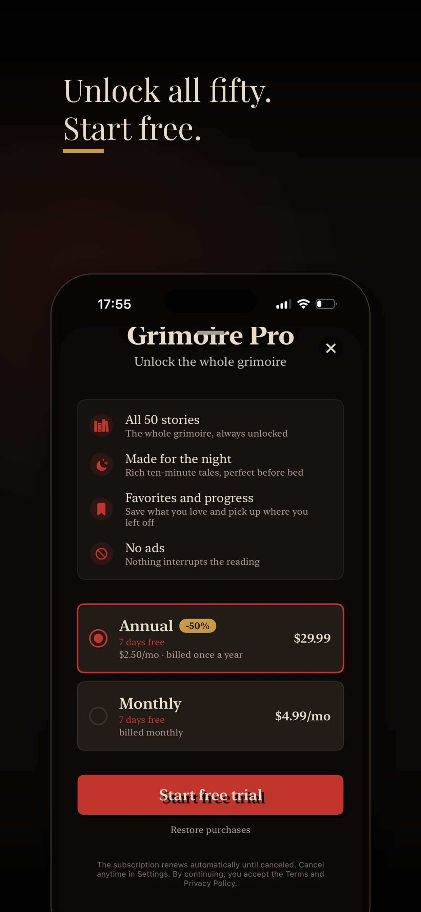

<div align="center">

# 📖 Grimoire

**Fifty dark tales for the night.**

*A gothic reading app for iOS — designed for the hour when the house goes quiet.*

<br />


</div>

---

## Screenshots

<table>
  <tr>
    <td align="center" width="33%">
      <br />
      <sub><b>Onboarding</b><br />From Apprentice to Archmage</sub>
    </td>
    <td align="center" width="33%">
      <br />
      <sub><b>Home</b><br />Featured story & tiers</sub>
    </td>
    <td align="center" width="33%">
      <br />
      <sub><b>Story detail</b><br />Chapters & metadata</sub>
    </td>
  </tr>
  <tr>
    <td align="center" width="33%">
      <br />
      <sub><b>Reader</b><br />Built for the dark</sub>
    </td>
    <td align="center" width="33%">
      <br />
      <sub><b>Favorites</b><br />Everything you saved</sub>
    </td>
    <td align="center" width="33%">
      <br />
      <sub><b>Grimoire Pro</b><br />Unlock the whole grimoire</sub>
    </td>
  </tr>
</table>

## About

Grimoire is a curated reader of **50 original gothic short stories**, each around ten minutes long — the kind of tale that stays with you after you close the app. The interface is built for reading in the dark: warm serif type, restrained motion, and a palette that lets the illustrations breathe.

The app opens with three free stories. The full grimoire is unlocked through **Grimoire Pro**, a subscription that removes ads and keeps your favorites and progress in sync.

## Features

- 🕯️ **Fifty original gothic tales**, each a ten-minute read
- 📖 **A reader built for the dark** — nighttime typography and pacing
- 🔖 **Favorites & reading progress** — pick up exactly where you left off
- 👑 **Progression system** — read your way from Apprentice to Archmage
- 🎧 **AI-narrated audio** (in development, powered by the [Grimoire Narration Pipeline](https://github.com/ItsJuniorDias))
- ⭐ **Free to start** — three stories on the house, the rest through Grimoire Pro
- 🚫 **No ads, ever** — the reading is never interrupted

## The Story System

Every story you finish moves your journey forward. Readers progress through tiers as they complete tales:

| Tier | Unlocked at |
| --- | --- |
| 🔥 Apprentice | Starting point — the free stories |
| 🕯️ Initiate | After completing your first Apprentice tales |
| 📜 Adept | Deeper into the grimoire |
| 👑 Archmage | The whole grimoire, from cover to cover |

Tags like `sea`, `mystery`, `courage`, and `night` let you find stories by mood.

## Tech Stack

- **Language:** Swift 5
- **IDE:** Xcode 15+
- **Target:** iOS 16+
- **In-app purchases:** StoreKit 2 (Grimoire Pro subscription — monthly & annual with 7-day free trial)
- **Content:** Original stories written for the app, illustrated covers, and animated cover backgrounds (`.mp4`)

## Getting Started

Clone the repo and open the project in Xcode:

```bash
git clone git@github.com:ItsJuniorDias/Grimoire.git
cd Grimoire
open Grimoire.xcodeproj
```

Then hit ⌘R to build and run on the simulator of your choice.

### Requirements

- macOS with Xcode 15 or newer
- An iOS 16+ simulator or a physical device
- An Apple Developer account (only required if you want to test StoreKit purchases on a device)

### Testing purchases

The Grimoire Pro subscription is defined in `Configuration.storekit`. In Xcode, edit the current scheme → **Options** → **StoreKit Configuration** and select that file to test purchases locally without a sandbox account.

## Project Structure

```
Grimoire/
├── Assets.xcassets/         # App icons, colors, illustrations
├── Content/
│   └── videos/              # Animated cover backgrounds (.mp4)
├── Sources/                 # Swift source files
└── Resources/               # Story JSON, localizations
Grimoire.xcodeproj/
```

## Roadmap

- [ ] iPad support with a wider reading layout
- [ ] Audio narration for every story (via [Grimoire Narration Pipeline](https://github.com/ItsJuniorDias))
- [ ] Localization: 🇧🇷 pt-BR, 🇪🇸 es-MX
- [ ] Widget with story of the day
- [ ] Reading streaks & tier badges

## Author

Built with care by **Alexandre Junior** ([@ItsJuniorDias](https://github.com/ItsJuniorDias)).

If Grimoire found its way into your evenings, a ⭐ on the repo means a lot.

## License

Copyright © 2026 Alexandre Junior. All rights reserved.

The source code in this repository is made available for **reference and educational purposes**. The story content, illustrations, and cover art are **not open source** and may not be redistributed without permission.

---

<div align="center">
  <sub>Made in the dark. ✒️</sub>
</div>
